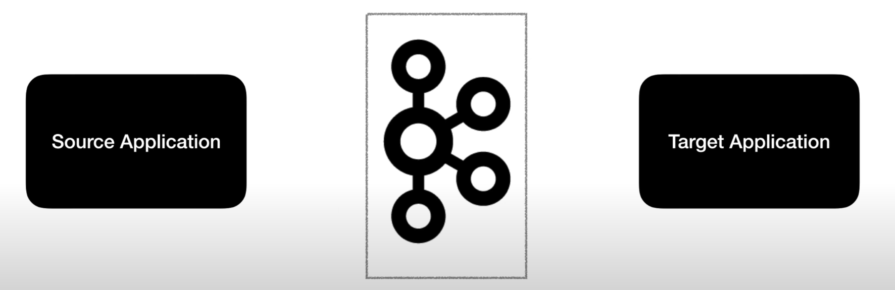
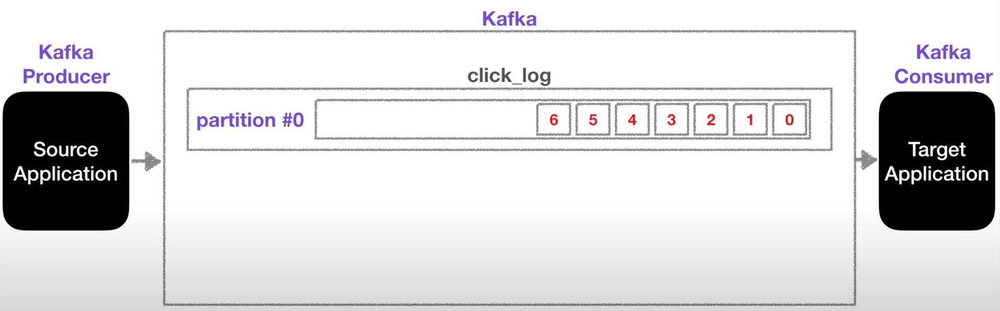
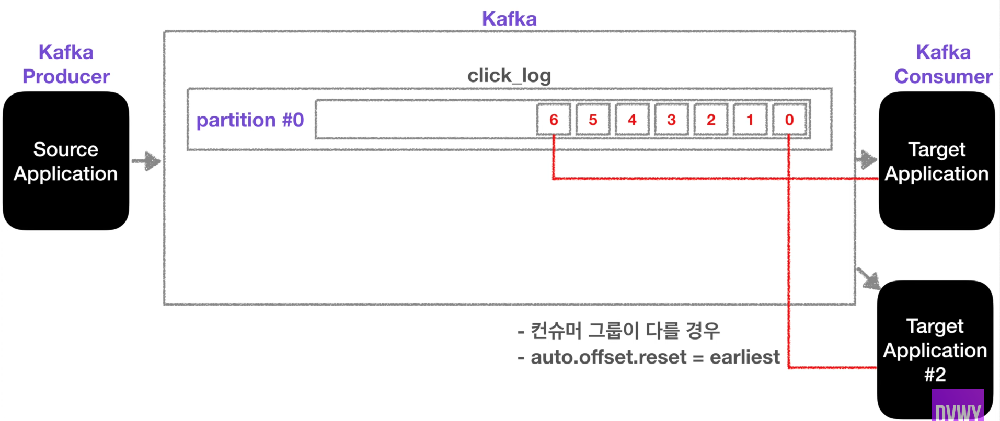
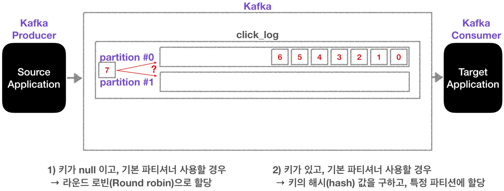
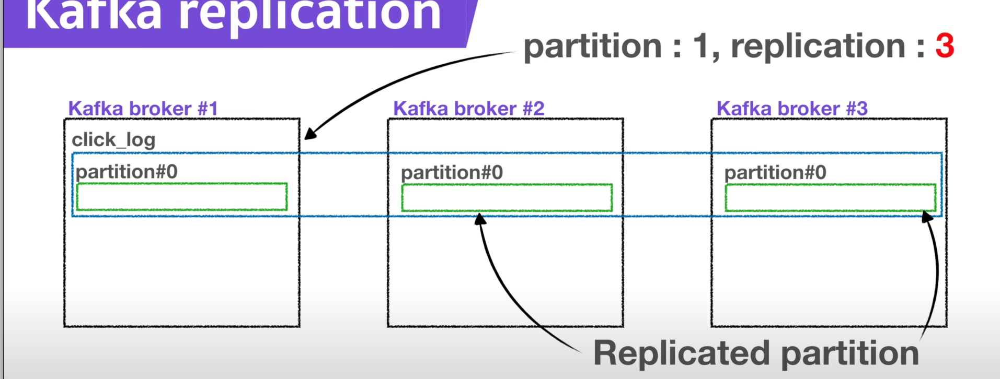
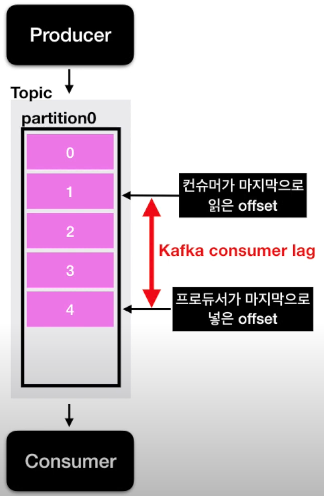

# Kafka 카프카

## 1. 카프카란?

아파치 카프카는 고성능 데이터 파이프라인, 스트르밍 분석, 데이터 통합 및 미션 크르티컬 애플리케이션을 위한 분산 이벤트 스트리밍 플랫폼이다.

> 오픈소스이기 때문에 무료이다.

- 아주 유연한 큐 역할을 한다.
- 고가용성이다.
- 낮은 지연과 높은 처리량으로 효과적으로 많은 데이터를 처리 가능하다.

- 소스 애플리케이션에서 카프카로 데이터를 전송한다.
  - ex) 결제 이벤트 전송, 상태 변경 이벤트 전송
- 타켓 애플리케이션은 카프카에 적제된 데이터를 가져온다.
  - ex) 결제 이벤트를 가져온 뒤 이벤트 처리, 상태변경 이벤트를 가져온 뒤 이벤트 처리
- 데이터를 보내는 형식은 제한이 없다.
  - Json, tsv, avro 기타 등등

- **Kafka Producer**
  - 카프카로 데이터를 전송하는 주체이다.
  - 라이브러리로 되어있어서 애플리케이션에서 구현이 가능하다.
- **Kafka Consumer**
  - 카프카에서 데이터를 가져가는 주체이다.
  - 라이브러리로 되어있어서 애플리케이션에서 구현이 가능하다.

- **Topic**
  - Topic은 큐라고 생각하면 된다.

## 2. 토픽(Topic)

토픽은 카프카에 데이터가 들어갈 수 있는 공간이다.

- 토픽은 일반적인 AMQP와는 다르게 동작한다.
- 토픽은 여러개 생성할 수 있다.
- 토픽은 이름을 가질 수 있으며, 목적에 따라 명확하게 해주면 추후 유지보수에 좋다.

- 카프카 프로듀서가 토픽에 데이터를 전송하면, 카프카 컨슈머가 해당 토픽에서 데이터를 가져간다.

- 하나의 토픽은 여러개의 파티션으로 구성될 수 있다.
- 첫번째 파티션 번호는 0번부터 시작하게 된다.(배열의 인덱스와 비슷한것 같다.)
- 하나의 파티션은 큐와 같이 내부의 데이터가 끝에서부터 차례대로 쌓이게 된다.
  - 그리고 컨슈머가 데이터를 가져갈때, 가장 오래된 순서대로 데이터를 가져간다.
  - 즉 그림의 0번부터 순서대로 가져간다. 0 -> 1 -> 2 -> .... -> 5 -> 6

- 카프카는 컨슈머가 데이터를 가져가더라도 데이터(레코드)는 삭제되지 않는다.
  - 내가 아는 큐는 SQS가 존재한데 SQS는 데이터를 읽어가면 해당 레코드는 사라진다.
  - 그러므로 다른 컨슈머가 데이터를 가져갈 때 0번부터 데이터를 가져갈 수 있다.
  - 허나 다른 컨슈머에서 데이터를 가져가려면 아래의 2가지 규칙을 지켜야 한다.
    - 컨슈머 그룹이 달라야 한다.
    - auto.offset.reset 옵션이 earliest여야 한다.
  - 데이터를 읽은 후 사라지지 않으면의 장점은 같은 데이터에 대해서 2번처리할 수 있다.

**파티션이 여러개일 경우**

파티션이 여러개일 경우 데이터를 저장하는 방식은 기본적으로는 2가지 경우가 있다.

1. 키가 null이고, 기본파티셔너를 사용할 경우 라운드로빈으로 파티션이 지정이 된다.
   - 마지막인 6번 데이터가 파티션 0번에 지정되어 있으므로, 7번 데이터는 파티션 1번에 저장되어진다.
2. 키가 있고, 기본 파티셔너를 사용할 경우
   - 키의 해시 값을 구하고, 특정 파티션에 할당한다.
   - 만약 키값이 파티션 0번을 가리킨다면, 7번 데이터는 첫번째 방식과는 달리 파티션 0번에 저장되어진다.

- 파티션을 늘리는 이유는?
  - 파티션을 늘리면 컨슈머의 개수를 늘려서 데이터 처리를 분산시킬 수 있다.
- 파티션의 데이터가 삭제되는 주기는?
  - 파티션의 데이터가 삭제되는 주기는 설정값에 따라 다르다.
  - log.retention.ms: 최대 record 보존시간
  - log.retention.byte: 최대 record 보존 크기(byte)

**주의점**

- 파티션을 늘리는 것은 주의를 해야한다.
  - 파티션을 늘리는 것은 계속해서 가능하지만, 파티션을 줄이는(삭제하는) 것은 불가능하다.

## 3. 브로커, 복제(Replication), ISR 핵심요소

#### 1. 카프카 브로커

- 카프카 브로커란 카프카가 설치되어 있는 서버단위를 말한다.
  - 보통 3개 이상의 브로커를 구성하는 것이 권장된다.

#### 2. 복제(Replication)

- 레플리케이션은 파티션의 복제를 의미한다.
- 레플리케이션은 파티션의 고가용성을 위해 사용된다.

- 그림과 같이 레플리케이션이 3이면 1개의 원본 파티션, 2개의 복제파티션이 생성된다.
  - 원본인 파티션은 Leader 파티션이라 한다.
  - 복제인 파티션은 Follower 파티션이라 한다.
  - Leader와 Follower 파티션은 합쳐서 [In Sync Replica](#3. ISR(In Sync Replica))라 볼 수 있다.
- replication은 브로커 개수와 연관되어 있다.
  - 만약 브로커는 3개인데, 레플리케이션은 4개는 될 수가 없다.
- replication의 적정 개수?
  - 카프카에 들어오는 데이터의 양과 retention date 즉 저장시간을 고려해서 설정해줘야 한다.
  - 보통 3개이상의 브로커를 사용할 때, 레플리케이션은 3이 추천된다.

### 

#### 3. ISR(In Sync Replica)

- ISR은 Leader와 Follow 파티션이 싱크가 된 상태를 의미한다.

#### 4. Replication & ack

- 리더와 팔로우 파티션의 역할은 무엇인가?
  - 리더 파티션은 프로듀서가 토픽의 파티션에 데이터를 전달할 때 받는 주체이다.
    - 프로듀서는 ack라는 상세옵션을 통해 고가용성을 유지할 수 있다. - 해당 옵션은 partition의 replication과 관련이 있다.
    - ack는 0, 1, all 옵션 3개중 1개를 골라서 사용할 수 있다.
    - ack가 0 일때: 
      - 프로듀서가 리더 파티션에 데이터를 전송하고 응답을 받지 않는다. 그러므로 데이터가 정상적으로 전송이 되었는지, 그리고 나머지 팔로우 파티션에 복제되었는지 알 수 없고, 보장이 되지 않는다.
      - 속도는 빠르지만 데이터의 유실 가능성이 존재한다.
    - ack가 1일때: 
      - 프로듀서가 리더 파티션에 데이터를 전송하고 응답을 받는다. 대신 팔로우 파티션에 데이터가 정상적으로 복제되었는지는 알 수 없다.
      - 리더 파티션이 데이터를 받은 즉시 팔로우 파티션에 데이터가 복제되는 상황에서 장애가 발생한다면, 데이터가 유시될 수 있을 가능성이 존재한다.
    - ack가 all일때: 
      - 프로듀서가 리터 파티션에 데이터를 전송하고, 팔로우 파티션에 데이터가 제대로 복제되었는지까지 응답값으로 전달 받는다.
      - 그러므로 데이터 유실은 존재하지 않다. 다만 0과 1에 비해 확인하는 것이 많기 때문에 속도가 현저히 느리다. 

## 4. 파티셔너(Partitioner)

- 프로듀서가 데이터를 보내면 무조건 파티셔너를 통해서 브로커로 데이터가 전송이 된다.
- 파티셔너는 데이터를 토픽의 어떤 파티션에 넣을지 결정한다.
- 레코드에 포함된 메시지 키 또는 메시지 값에 따라서 파티션의 위치가 결정된다.

- 프로듀서를 사용할 때 파티셔너를 따로 설정해주지 않는다면, UniformStickyPartitioner로 설정이 된다.
  - 해당 파티셔너는 메시지키가 있을 때와 없을 때 다르게 동작하게 된다.
  - 메시지 키가 있는 경우
    - 메시지키를 가진 레코드는 파티셔너에 의해서 특정한 해쉬값이 결정되는데, 해당 해쉬값을 통해 파티션이 결정된다.
    - 동일한 메시지 키값을 가진 레코드는 항상 동일한 해쉬코드를 만들기 때문에, 항상 동일한 파티션에 들어가는 것을 보장한다.
    - 이런경우 동일한 파티션에 계속 들어가게 되므로 순서를 지켜서 데이터를 처리할 수 있다.
  - 메시지 키가 없는 경우
    - 메시지 키가 없는 레코드는 라운드로빈으로 파티션에 들어가게 된다.
    - 프로듀서에서 배치로 모을 수 있는 최대한의 레코드를 모아서 파티션으로 데이터를 보내는데, 해당 레코들은 배치를 진행할 때 각가의 파티션에 라운드로빈으로 들어가게 된다.
- 파티셔너는 UniformStickyPartitioner이 아닌 직접 개발한 파티셔너도 설정할 수 있다.
  - kafka에서는 커스텀 파티셔너를 만들 수 있도록 Partitioner 인터페이스를 제공하고 있다.
  - 커스텀한 파티셔너를 이용해서, 메시지 키 또는 값, 토픽의 이름에 따라서 어떤 파티션에 값을 저장할지 설정할 수 있다.

## 5. 랙(Lag)

- 컨슈머 랙이란?

  - 프로듀서가 카프카에 데이터를 넣을 때 데이터는 오프셋이라는 숫자가 붙게 된다.

    - 만약 파티션이 1개인 토픽에 데이터를 넣는 가정을 해보자.

      

    - 그림과 같이 순서대로 데이터가 쌓이면서 offset이 설정된다.
    - 작업이 진행 되면서 프로듀서가 마지막으로 넣은 offset이 존재하고, 컨슈머가 마지막으로 읽은 offset이 존재하게 된다.

  - 작업이 진행 될 때, 프로듀서가 컨슈머가 읽는 속도보다 더 빨리 데이터를 넣게 되면 둘 사이간의 offset 간격이 발생한다.

  - 이때 발생한 프로듀서의 offset과 컨슈머의 offset의 차이를 **컨슈머 랙이라고 한다.** 

  - 컨슈머 랙은 많을 수도 있고 적을 수도 있다.
  - 컨슈머 랙을 통해 파이프라인으로 연계되어 있는 프로듀서와 컨슈머의 상태에 대해 유추 가능하다.
    - 주로 컨슈머의 상태를 볼 때 사용된다.

- 랙은 보통 파티션에 대해 프로듀서가 전송하는 offset과 컨슈머가 읽은 offset의 차이를 기반으로 한다.

  - 그러므로 랙은 파티션의 개수에 따라 여러개가 존재할 수 있다.
  - 만약 컨슈머 그룹이 1개이고 파티션이 2개인 그룹에서 데이터를 가져간다면 랙이 2개가 측정될 수 있다.
    - 측정된 랙 중 높은 숫자의 랙을 records-lag-max라고 부른다.

## 6. 이벤트 브로커, 메시지 브로커

- 메시지 브로커란?
  - 메시지 브로커는 데이터를 전송하고 처리하고 삭제를 한다.
  - 대표적인 소프트웨어의 예로는 래빗MQ와 레디스 큐가 존재한다.
- 이벤트 브로커란?
  - 메시지 브로커와는 비슷하지만 다른구조로 동작되며, 데이터를 전송하고 처리를 하며 저장을 한다.
  - 이벤트 브로커의 장점으로는 장애가난 시점부터 다시 데이터를 처리할 수 있다.
  - 대표적인 소프트웨어의 예로는 아파치 카프카 또는 AWS의 키네시스가 존재한다.